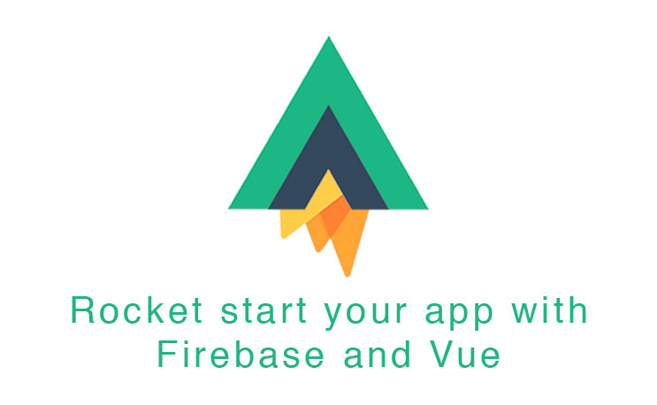

# A Vue 2 + Firebase Boilerplate



## Description

VueRocket is a Vuejs 2 + 🔥 Firebase boilerplate for making medium to large web apps.
It allows you to concentrate on developing __valuable__ features on __day 1__.


## What's included?

Project is based on Vue-Cli Webpack2 template. It uses ESLint with AirBnB's norm. Global architecture was made to meet following criteria:

- [x] __Efficient & Clear Project Structure__
  - A good structure is essential to build reusable and maintainable apps without breaking all your code each time you push a new feature.
- [x] __Login, Register, Profile and ResetPassword pages__
  - Almost any app needs to register and login users, right? That's why this boilerplate includes a super simple and fully customizable ready to use members system.
- [x] __Configured State Management__
  - State management is a must have in all applications. It allows you to manage user authentication and all global variables between components. Here we use Vuex to manage this global state inside the app. Everything is configured and ready to use: getters, mutators, actions, mixins...
- [x] __Ready To Translate (i18n)__
  - As a developer you are lazy and busy, you'll never have time to loose on translating your app. Unfortunately, if your CEO has this idea in mind, you'll - one day - have to do it. The good part is that this boilerplate already supports translation. But a much better news is that i18n is also plugged to the Vuex store allowing you to translate every components from everywhere in one click.
- [x] __Light Components Library (RIP Material Design)__
  - There is no issue with Material Design components but all libraries out there are very... you know... HUGE. It's a perfect shot for some project but when you have to do some customization it's like sending a SMS to __Freddy Krueger__ before to go to bed. Here we use [Element](http://element.eleme.io/#/en-US), a small, clean beautiful and highly customizable components library.
- [x] __Stylus ready__
  - Easy to use stylus structure allows you to supercharge your CSS with variables and create a super cool and reusable theme.
- [x] __The more important... Firebase__
  - How many backend did you write in your life? Dozens, hundreds? Write no more backend with Firebase, it's included, configured and ready to store your amazing stuff.


## Based on best plugins

- [x] Vuex
- [x] Element ui (lightweight and powerful VueJs components lib)
- [x] Vue-Router
- [x] Firebase
- [x] Axios
- [x] Vue i18n


## Try it

``` bash
# install dependencies
npm install

# serve with hot reload at localhost:8080
npm run dev

# build for production with minification
npm run build

# You're all set
```

For detailed explanation on how things work, checkout the [guide](http://vuejs-templates.github.io/webpack/) and [docs for vue-loader](http://vuejs.github.io/vue-loader).
